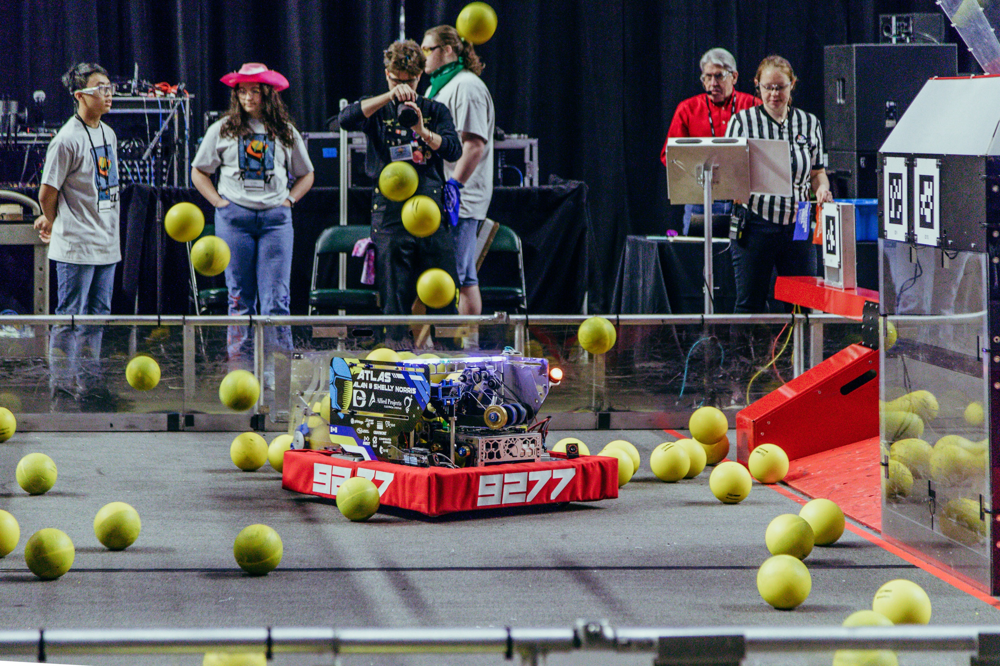
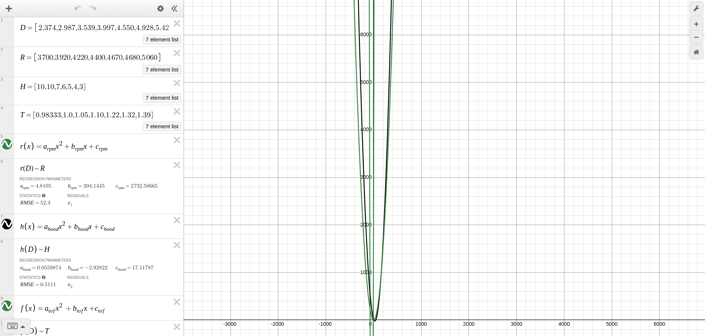
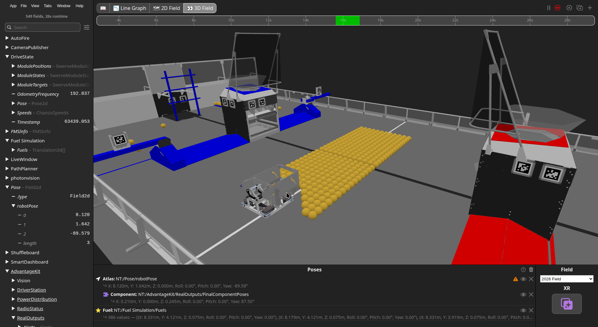

# 9277 2026 (REBUILT)

> [!NOTE]
> This repository was made and ran on 9277's robot for the 2026 *FIRST* Robotics Competiton season, **Atlas** (pictured above).

## Structure

This project is a WPILib command-based project written in Java.

* `src/main/java/frc/robot` - Source code location
    * `/commands` - Misc. commands
    * `/generated` - Swerve drive code generated by [Phoenix Tuner X](https://v6.docs.ctr-electronics.com/en/stable/docs/tuner/tuner-swerve/index.html)
    * `/subsystems` - All the subsystems on Atlas
    * `/util` - Basic utilities
    * `/vision` - Vision subsystem
    * `/Constants.java` - All constants for the project

## Shooter

For this season, we chose to build a single-shooter turret. The turret tracks the hub by calculating the robot's angle to the hub, adding on the robot's own rotation from the gyroscope, and setting the turret to that angle. Due to the 3-4 cameras that are located on the corners of Atlas, there is enough vision to always know where the robot is relative to the hub.

To find the shooter speed, hood angle and time of flight, a [quadratic regression](https://en.wikipedia.org/wiki/Polynomial_regression) is used. A few data points were collected by setting the shooter speed and hood angle manually. Then, using Desmos, we're able to find the coefficients for a quadratic regression that allows us to interpolate and extrapolate the shooter speed, hood angle and TOF.

A link to this Desmos graph can be found [here](https://www.desmos.com/calculator/aitlewjs62).

## AdvantageScope

1. In AdvantageScope click `App` -> `Use Custom Assets Folder` -> and select the `AdvantageScope` folder in this repo.
2. Drag in the robot pose from `NT:/Pose/robotPose` into the Poses section
3. Select `Atlas` for the robot model
4. To get the turret moving, drag `FinalComponentPoses` (`NT:/AdvantageKit/RealOutputs/FinalComponentPoses`) from Network Tables into the robot pose.

If you would like to use the [FuelSim](https://github.com/hammerheads5000/FuelSim) (thank you [5000 Hammerheads](https://thebluealliance.com/team/5000)!), drag `NT:/Fuel Simulation/Fuels` into Poses as well.
